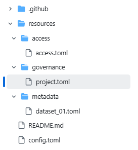

# Overview

Cookiecutter template is used for generating 5-Safes RO-Crates using Cr8tor CLI app.


Example use in cr8tor cli: default, with cookiecutter prompts:

```text

uv run  cr8tor  initiate -t "https://github.com/lsc-sde-crates/cr8-cookiecutter"

```

The command will download cookiecutter and start the prompt:


Example - without cookiecutter prompts

```text

uv run  cr8tor  initiate -t "https://github.com/lsc-sde-crates/cr8-cookiecutter" -n "project4" -org "lsc-sde-crates" -e "DEV"

```

[Cr8tor CLI Initiate command](./../cr8tor-cli/commands.md#initiate-project) expects `template_path` as a parameter. It should be either the GitHub url or a relative path to the cookiecutter template. Additionally, it can accept `checkout` parameter which will be used as a reference to CookieCutter GitHub's branch, tag or a commit during repos initiation.

After successful run, the cookiecutter should generate a new repository:

