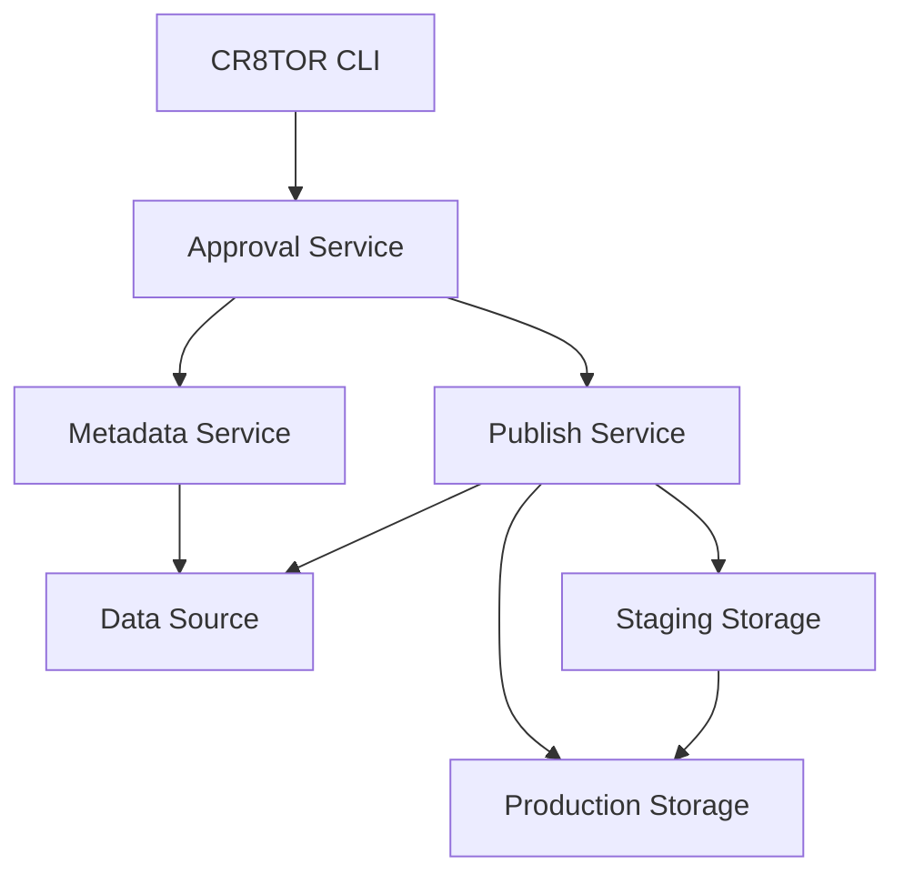

# CR8TOR Publisher Overview

The CR8TOR Publisher is a microservices-based platform that facilitates secure data access requests, enabling users to request, approve, and retrieve datasets safely and efficiently. The publisher consists of three FastAPI-based microservices that work together to orchestrate the data transfer process.

## Architecture Components

The CR8TOR Publisher comprises three microservices:

### 1. Approval Service

The **Approval Service** acts as an API gateway, taking requests from the outside world and forwarding them to the relevant services. It serves as the main entry point for all CR8TOR operations.

**Key Features:**

- API gateway functionality for routing requests
- Request validation and authentication
- Coordination between Metadata and Publish services
- Centralized error handling and response formatting

**Main Endpoints:**

- `POST project/validate` - Validates connections and retrieves metadata
- `POST project/package` - Initiates data packaging to staging
- `POST project/publish` - Publishes data to production storage

[See detailed Approval Service documentation](https://github.com/lsc-sde-crates/cr8tor-publisher/blob/main/approval-service/docs/service.md)

### 2. Metadata Service

The **Metadata Service** fetches dataset metadata, including table-column level descriptions, data types, and names, without exposing the actual data.

**Key Features:**

- Validates source and destination connections
- Retrieves metadata from data sources (e.g. SQL Server, MySQL, PostgreSQL, Databricks Unity Catalog)
- Provides schema information for requested datasets
- Ensures metadata accuracy without data exposure

**Main Endpoints:**

- `POST metadata/project` - Retrieves and validates dataset metadata

[See detailed Metadata Service documentation](https://github.com/lsc-sde-crates/cr8tor-publisher/blob/main/metadata-service/docs/service.md)

### 3. Publish Service

The **Publish Service** handles the actual data transfer operations, retrieving datasets from source systems and packaging them for consumption.

**Key Features:**

- Data extraction from source databases (e.g. SQL Server, MySQL, PostgreSQL, Databricks Unity Catalog)
- Data packaging and format conversion (csv or DuckDB)
- Staging and production data management
- Hash calculation and integrity verification using BagIt

**Main Endpoints:**

- `POST data-publish/validate` - Validates source/destination connections
- `POST data-publish/package` - Packages data to staging container
- `POST data-publish/publish` - Publishes data to production container

[See detailed Publish Service documentation](https://github.com/lsc-sde-crates/cr8tor-publisher/blob/main/publish-service/docs/service.md)

## Destination Type Behaviors

The Publish Service adapts its data handling behavior based on the specified project destination type:

### PostgreSQL Destination

When the project destination is configured as `postgresql`, the Publish Service:

- **Data Loading**: Loads the source data directly into a PostgreSQL database
- **OPAL Integration**: Creates and configures [Obiba OPAL](https://github.com/obiba/opal) components for secure data access:
  - Creates an OPAL project for the dataset
  - Establishes OPAL resources pointing to PostgreSQL tables within the project
  - Creates DataSHIELD permission groups (named `{project_name}_group`)
  - Assigns DataSHIELD permissions to the created groups
  - Sets resource-level permissions for the groups to access project data
- **Access Control**: Leverages OPAL's DataSHIELD framework for secure, privacy-preserving data analysis

### Filestore Destination

When the project destination is configured as `filestore`, the Publish Service:

- **File-based Storage**: Loads data to the mounted filestore rather than a database
- **Two-stage Process**:
  1. **Staging Phase**: Data is first written to a staging container/filestore
  2. **Production Phase**: Data is then moved from staging to the production container/filestore
- **Format Options**: Data can be packaged in multiple formats (CSV or DuckDB) for flexible consumption

This destination-specific behavior ensures optimal data handling and access patterns for different target environments while maintaining consistent security and governance standards.

## Required Environment Variables

The Publish Service requires different environment variables depending on the destination type:

### PostgreSQL Destination Environment Variables

When using PostgreSQL as the destination, the following environment variables are required:

**OPAL Configuration:**

- `DESTINATION_OPAL_HOST` - The OPAL server host URL
- `DESTINATION_OPAL_USERNAME` - Username for OPAL authentication
- `DESTINATION_OPAL_PASSWORD_SECRET_NAME` - Name of the secret containing the OPAL password
- `DESTINATION_OPAL_NO_SSL_VERIFY` - Whether to skip SSL verification (default: "false")

**PostgreSQL Configuration:**

- `DESTINATION_POSTGRESQL_HOST` - PostgreSQL server host
- `DESTINATION_POSTGRESQL_PORT` - PostgreSQL server port
- `DESTINATION_POSTGRESQL_DATABASE` - Target database name
- `DESTINATION_POSTGRESQL_OPAL_READONLY_USERNAME` - Read-only username for OPAL resource access
- `DESTINATION_POSTGRESQL_OPAL_READONLY_PASSWORD_SECRET_NAME` - Name of the secret containing the read-only password

### Filestore Destination Environment Variables

When using filestore as the destination, the system uses mounted filesystem paths and doesn't require additional destination-specific environment variables beyond the standard storage mount configuration.

### OPAL Integration Details

For PostgreSQL destinations, the system performs the following OPAL operations:

1. **Project Creation**: Creates an OPAL project named after the CR8TOR project
2. **Group Management**: Creates a DataSHIELD group named `{project_name}_group`
3. **User Management**: Ensures a default DataSHIELD user (`dsuser_default`) exists and is assigned to the group
4. **Resource Creation**: Creates OPAL resources for each PostgreSQL table with naming pattern `tre_postgresql_{schema}_{table}`
5. **Permission Assignment**:
   - Adds the group to DataSHIELD permissions with "use" permission
   - Sets resource-level permissions for the group with "view" permission on the project

The OPAL resources are configured as SQL resources pointing to the specific PostgreSQL tables, enabling secure DataSHIELD-compliant data access for approved users.

## Data Flow Architecture

## Deployment Architecture

The microservices are containerized using Docker and designed to be deployed on Kubernetes clusters such as Azure Kubernetes Service (AKS). Each service:

- Runs in its own container with isolated dependencies
- Supports volume mounting for secrets and configuration
- Provides health checks and monitoring endpoints
- Scales independently based on workload demands

## Security Features

- **API Key Authentication**: Each service uses static API keys for inter-service communication
- **Secret Management**: Secrets are mounted at container level and stored in a secure credential storage (e.g. Azure Key Vault)
- **Data Isolation**: Services operate with minimal data exposure principles
- **Audit Logging**: Comprehensive logging of all data access operations

## Integration with CR8TOR Workflow

The publisher services integrate seamlessly with the CR8TOR CLI workflow:

1. **Validation Phase**: Metadata Service validates data source connections
2. **Staging Phase**: Publish Service extracts and stages data
3. **Publication Phase**: Publish Service moves data to production storage

???+ note "Infrastructure Requirements"

    The Lancashire and Cumbria Secure Data Environment department uses Azure Kubernetes to host and run the microservices within their SDE environment. The specific Infrastructure and Kubernetes (K8S) configuration [can be found here](https://github.com/lsc-sde-crates/cr8tor-publisher/blob/main/docs/services.md#installation-onto-kubernetes).

## Configuration Management

All services support:

- Environment variable configuration
- Docker network communication
- Secrets mounting for sensitive data
- Configurable storage paths and endpoints

For detailed configuration information, see the individual service documentation linked above.
