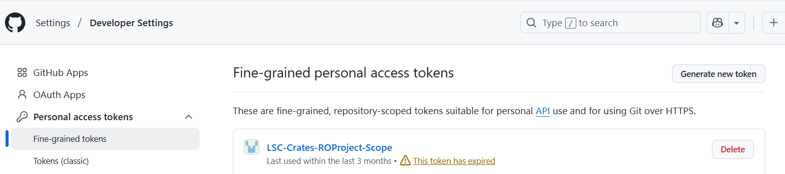
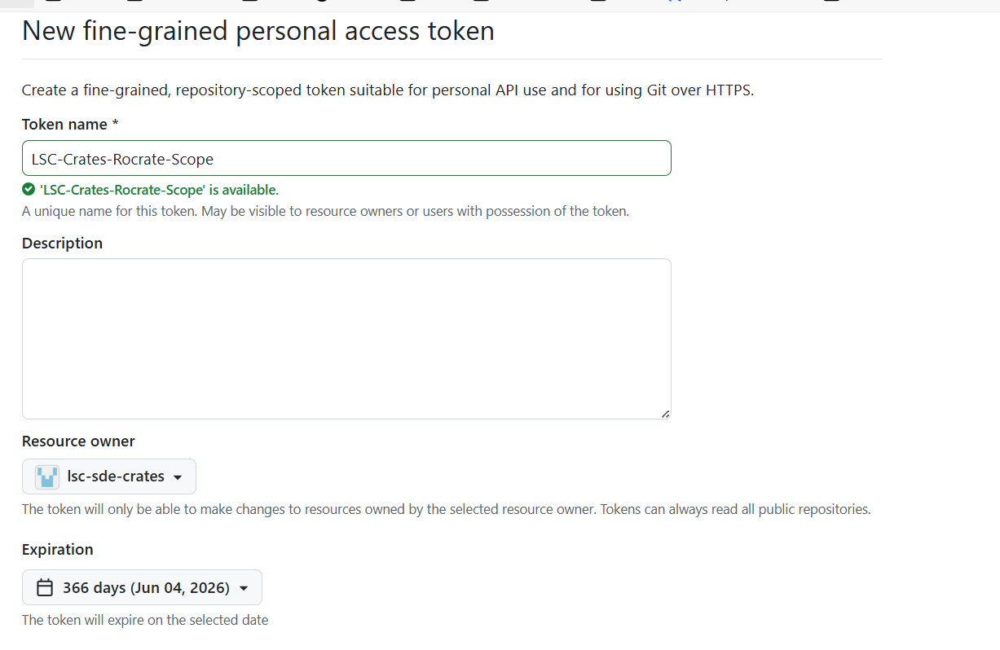
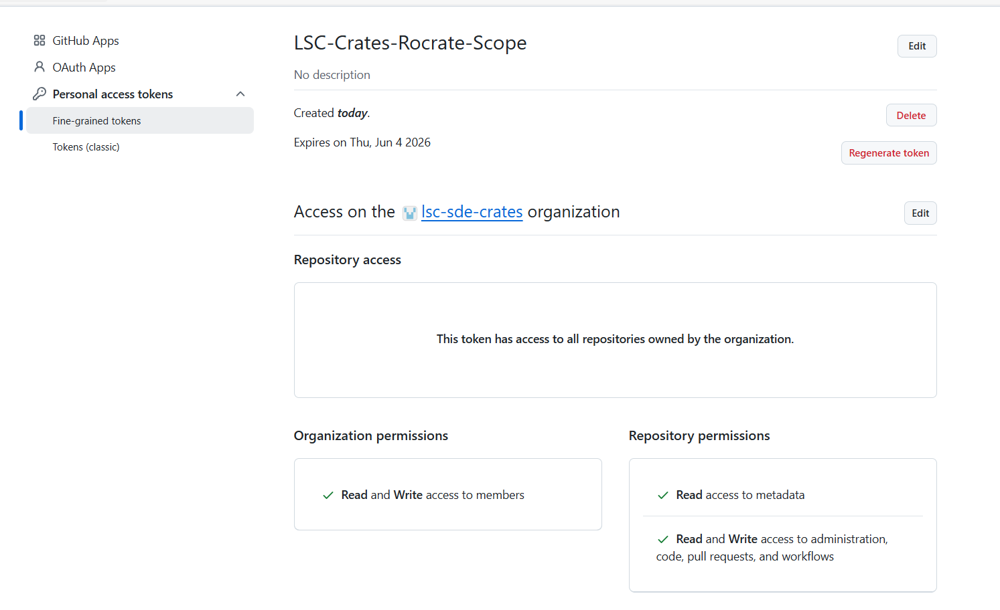

# Orchestration layer setup

This section explains key setup up requirements for the Orchestration layer of Cr8tor Solution.

## Table of Contents

- [Orchestration layer setup](#orchestration-layer-setup)
  - [Table of Contents](#table-of-contents)
  - [GitHub Runners](#github-runners)
  - [GitHub Organisation settings](#github-organisation-settings)
  - [GitHub Organisation secrets](#github-organisation-secrets)
  - [GitHub Teams](#github-teams)
    - [Adding new members](#adding-new-members)
  - [GitHub PAT token](#github-pat-token)
  - [DAR Project Repo settings](#dar-project-repo-settings)

## GitHub Runners

GitHub runners must:

- be **a single runner per environment**. Currently, in LSC SDE Crates organisation there are three environments defined: DEV, TEST, PROD.

- be **Windows** type (if Unix based, then cr8tor orchestrator.yml workflow requires updates from pwsh commands to batch commands).

- have a **tag** with pattern `<env>-cr8tor-vm`, e.g. `dev-cr8tor-vm`. Required by Orchestrator workflow.

- have **git** (<https://git-scm.com/downloads/win>) and **github cli** (<https://cli.github.com/>) installed.

- set up in GitHub at **Organisation level**.

## GitHub Organisation settings

Apart from the default GitHub Organisation settings, make sure to have below:

- Actions -> General -> **Workflow permissions: Read ad write permissions**. Also, **Allow GitHub Actions to create and approve pull requests**.

## GitHub Organisation secrets

In order to use Cr8tor-Publisher microservices (deployed to Kubernetes), we need to provide Host and Token information for Approval Service Endpoint, for each environment seperatly.

The secrets must be stored at Organisation level and follow the name pattern:

- `APPROVALS_API_TOKEN_<DEV/TEST/PROD>`

- `APPROVALS_HOST_<DEV/TEST/PROD>`

The very same API Token secrets must be stored in the Key Vault which is mounted/accessed by the Microservice (e.g. Azure Key Vault).

## GitHub Teams

The Orchestration layer relies on the GitHub Teams. There are **three types of teams** defined:

- `cr8-ALL-projects-approver` - currently, a single group which will approve all DAR requests. Members are notified when the GitHub Orchestration workflow reaches specific environments, such as `signoff` (indicating the need for final approval before deployment) or `disclosure` (indicating readiness for public release). By default, members have **READ** role on assigned DAR repositories.
- `devops_admin` - team is used in the CODEOWNERS file defined in each DAR repository in the .github folder. The CODEOWNERS file specifies individuals or teams responsible for reviewing changes to specific files or directories in the repository. This ensures that updates to critical files, such as workflow definitions, are reviewed and approved by the appropriate team. By default, members have **WRITE** role on assigned DAR repositories.
- `cr8-<project_name>-contributor` - team created automatically during DAR repository initiation when the `cr8tor initiate` command is executed. Members have **WRITE** role on assigned DAR repositories.

The `cr8-ALL-projects-approver` and `devops_admin` teams must be created **manually** if they do not exist in the GitHub organisation. This is because these teams are organisation-wide and not tied to a specific project, unlike `cr8-<project_name>-contributor`, which is created **automatically** during the initiation of a new DAR project.

### Adding new members

Click on a chosen team `cr8-ALL-projects-approver`, `devops_admin` or `cr8-<project_name>-contributor`, then **Add a member**. Invitation to Organisation might be required.

## GitHub PAT token

[Cr8tor Initiate command](./../cr8tor-cli/commands.md#initiate-project) uses a Fine-grained Personal access token (PAT) to create a DAR project repository in GitHub or to create a new GitHub Team for DAR project's contributors and assigning other organisational and repository level settings.

The fine-grained PAT token needs to be created by GitHub Organisation administrator. It should have the following permissions:

**Repository permissions**:

- Administration: Read and write
- Contents: Read and write
- Metadata: Read-only
- Pull requests: Read and write
- Workflows: Read and write

**Organization permissions**:

- Members: Read and write

Steps:

1. Go to GitHub Settings to generate PAT token (<https://github.com/settings/personal-access-tokens/>)
 
{ width=75% }
 
2. Use following settings:
**name**: provide the value that you will easily identify PAT's permissions for. e.g. LSC-Crates-Rocrate-Scope
**resource owner**: restrict to the GitHub Organisation containing DAR repos, e.g. lsc-sde-crates
**expiration**: eg 366 days or less
**repository access**: set to ALL repositories, as we use PAT token to create new private repos
**permissions** see the above list.
 
{ width=75% }
 
Once the PAT token is created you should see below summary:
{ width=75% }
 
3. Go to the **CR8TOR Repository** and create/update the **repository secret** named **ORG_LVL_RW_REPOS_TEAMS**.
  We use the secret in the Init RO-Crate Project workflow running cr8tor initate command using the Github runner.
  If you want to run cr8tor commands locally, create/obtain the token with the same permission scope.

{ width=50% }

???+ warning
    **ORG_LVL_RW_REPOS_TEAMS is only at cr8tor repository level, not organisational level**.

## DAR Project Repo settings

Each new DAR project is automatically created with two repository level environments:

- `signoff`
- `disclosure`

Both of them have **protection rules** which requires `cr8-ALL-projects-approver` to review the workflow run.
This is all **automatically set up** on DAR repository creation when [cr8tor initiate command is run](./../user-guide/create-new-dar-project.md).

Environments:
 
{ width=75% }
 
Protection rules:
 
{ width=75% }
