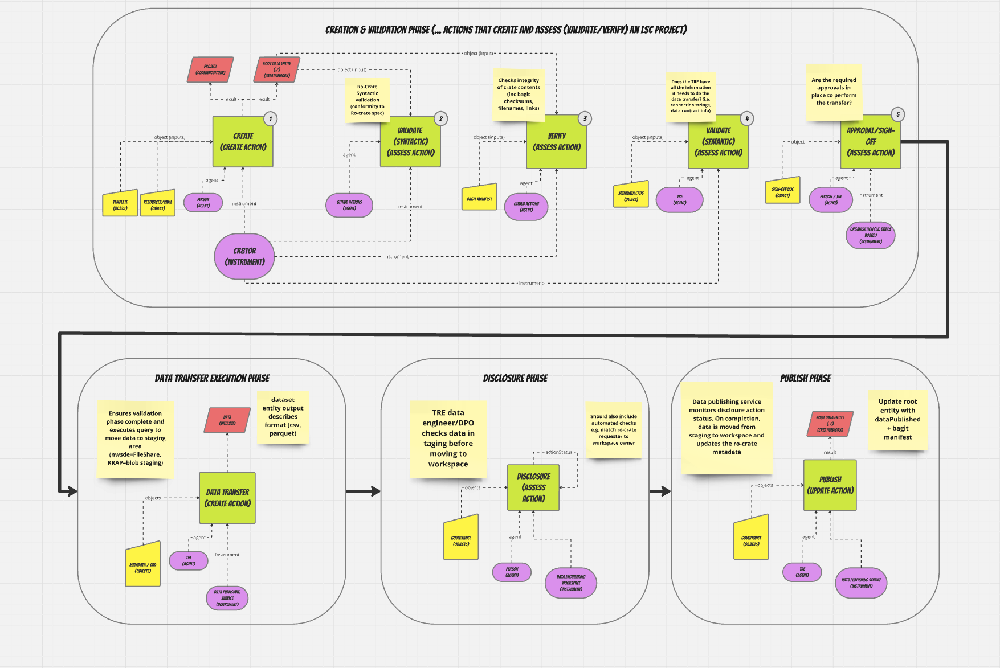

# CR8TOR CLI

Cr8tor CLI is a management tool that supports semi-automated, metadata-driven movement of RO-Crate-compliant data packages across Secure Data Environment (SDE) infrastructures. Cr8tor is inspired and builds on the [5-Safes RO-Crate Profile](https://trefx.uk/5s-crate/) to execute a common workflow (e.g. data validation, staging and publishing) to support the ingress of a target dataset(s) into a secure workspace accessible to the requesting entity (i.e. researcher, clinican). Cr8tor provides capabilities to initiate a 'data project', based on a data access request (DAR), as a managed repository within a SDE operator's github organisation. Once initialised, cr8tor supports a series of commands that can be performed by an authorised agent (e.g. SDE data engineer) from terminal or via an automated workflow (e.g. Github Action) to validate, approve and signal the transfer of data from a source data store to a target storage account within a Trusted Research Environment (TRE).

## Cr8tor Project Structure
Cr8tor manages the execution of actions on a target 'data project' github repository. The project repository comprises a collection of TOML metadata files (in the the ./resources directory) that include a minimal set of properties required to represent project **governance** information (e.g. project name, reuqesting agent, state of actions performed), data **access** information (e.g. connectivity to source data stores and target TREs) and **metadata** describing the specific dataset(s) requested.

## RO-Crate Workflow Model

