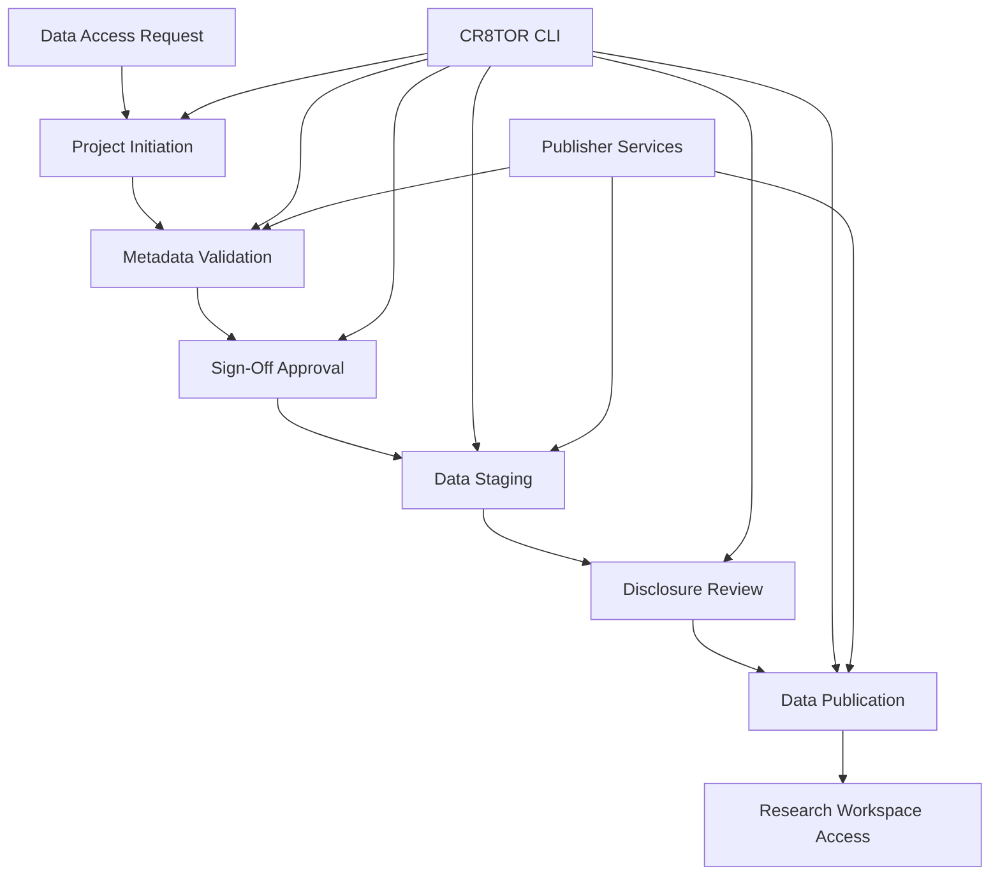
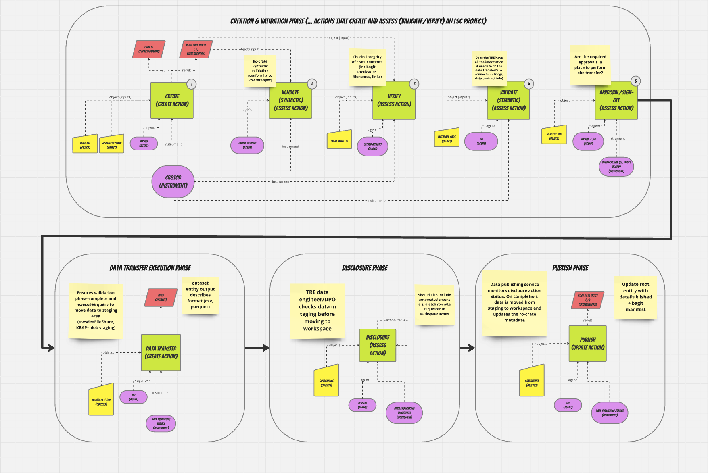

# CR8TOR - 5-Safes Compliant Data Orchestration

CR8TOR is a comprehensive data orchestration platform that supports semi-automated, metadata-driven movement of RO-Crate-compliant data packages across Secure Data Environment (SDE) infrastructures. The platform is inspired by and builds on the [5-Safes RO-Crate Profile](https://trefx.uk/5s-crate/) to execute a common workflow (e.g., data validation, staging and publishing) to support the secure ingress of target dataset(s) into research workspaces accessible to requesting entities (researchers, clinicians).

## Platform Components

CR8TOR consists of two main components working together to provide a complete data access solution:

### CR8TOR CLI

A command-line interface that provides capabilities to:

- **Initiate** data projects based on data access requests (DAR)
- **Create** managed repositories within SDE operator's GitHub organizations
- **Validate** and approve data access requests through structured workflows
- **Orchestrate** data transfer operations from terminal or automated workflows (GitHub Actions)
- **Build** compliant RO-Crate packages following 5-Safes specifications

### CR8TOR Publisher

A microservices platform consisting of three FastAPI-based services:

- **Approval Service**: API gateway coordinating data access operations
- **Metadata Service**: Validates connections and retrieves dataset metadata
- **Publish Service**: Handles data extraction, staging, and production publishing

## CR8TOR Project Structure

CR8TOR manages the execution of actions on target 'data project' GitHub repositories. Each project repository comprises a collection of TOML metadata files in the `./resources` directory that include a minimal set of properties required to represent:

- **Governance Information**: Project name, requesting agent, state of actions performed
- **Access Information**: Connectivity to source data stores and target TREs
- **Metadata**: Descriptions of specific dataset(s) requested

## Data Access Workflow

The CR8TOR platform implements a structured workflow that ensures secure and compliant data access:

### Workflow Phases

1. **Initiation**: Create structured DAR project with governance metadata
2. **Validation**: Verify data source connections and retrieve metadata
3. **Approval**: Human approval for validated data access requests
4. **Staging**: Extract and stage data in secure intermediate storage
5. **Disclosure**: Review and approve staged data for production
6. **Publication**: Move approved data to production research environment

## 5-Safes Compliance

CR8TOR ensures compliance with the 5-Safes framework through:

- **Safe Projects**: Structured project governance and approval workflows
- **Safe People**: Identity verification and role-based access controls
- **Safe Data**: Metadata validation and secure data handling
- **Safe Settings**: Controlled research environments and access policies
- **Safe Outputs**: Audited data transfer with integrity verification

## Getting Started

### For Data Requesters

1. Review the [User Guide](user-guide/create-new-dar-project.md) for creating data access requests
2. Understand the [approval workflow](user-guide/orchestrate-dar.md) and requirements
3. Learn about [troubleshooting](user-guide/troubleshooting.md) common issues

### For SDE Operators

1. Set up the [orchestration layer](developer-guide/orchestration-layer-setup.md)
2. Configure [source systems](developer-guide/source-setup.md) for data access
3. Deploy and configure the [Publisher services](cr8tor-publisher/overview.md)

### For Developers

1. Review the [CLI development guide](cr8tor-cli/development.md)
2. Explore the [command reference](cr8tor-cli/commands.md)
3. Understand the [service architecture](cr8tor-publisher/overview.md)

## Architecture Overview

The platform architecture separates concerns between:

- **Command Layer**: CR8TOR CLI for user interactions and workflow orchestration
- **Service Layer**: Publisher microservices for data operations
- **Storage Layer**: Staging and production storage with integrity verification
- **Integration Layer**: GitHub, Azure services, and external data sources

## Support and Documentation

- **GitHub Repositories**:
  - [CR8TOR CLI](https://github.com/lsc-sde-crates/cr8tor)
  - [CR8TOR Publisher](https://github.com/lsc-sde-crates/cr8tor-publisher)
- **Issue Tracking**: Use GitHub Issues for bug reports and feature requests
- **Documentation**: This site provides comprehensive documentation for all components

---

*CR8TOR is developed and maintained by the Lancashire and South Cumbria Secure Data Environment (LSC SDE) team.*
