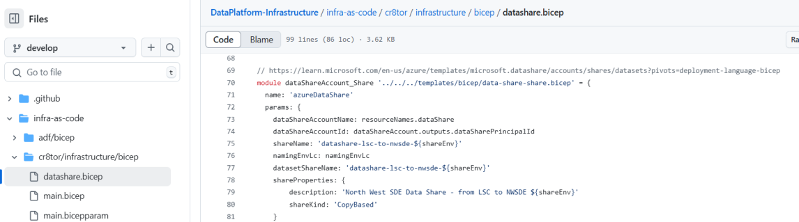
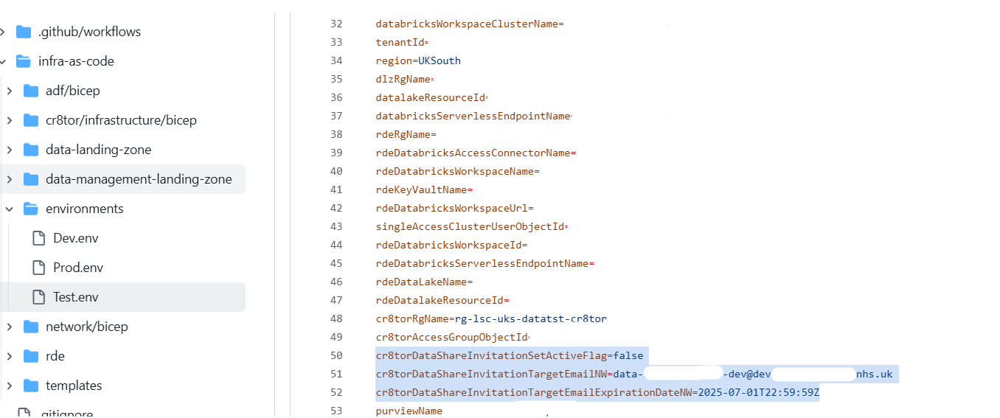

# Azure Data Share

Azure Data Share (ADS) is used to distribute data between separate Azure tenancies in a safe and controlled manner.
We use ADS to share the extracted data with the North West (NW) SDE. The resource, as well as the data share and invitation, is created using Bicep, alongside other required resources [explained here](./infrastructure.md)

Using the environment config files, we can control whether the invitation should be sent during the release action, change the associated email, and set the invitation expiration date.
If we want to send the invitation only when releasing to the Test environment, create a release branch following the lsc-sde branching strategy and update the *Test.env* file in that branch. Then run the workflow.

**Alternatively, create the invitation manually** in Azure Data Share if you have the correct permissions on the given resource group and subscription. Follow the naming patterns defined in the Bicep templates.

