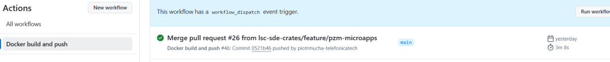

# Deployment to Kubernetes

LSC SDE uses Azure Kubernetes, Helm charts, and Flux for deployment and running Docker containers.
The installation guide is [currently available here](https://github.com/lsc-sde-crates/cr8tor-publisher/blob/main/docs/services.md#installation-onto-kubernetes).

Cr8tor Publisher microservices are deployed to separate Kubernetes clusters, each dedicated to a specific environment:

| Environment | Endpoint                     | GitHub Self-Hosted Runner |
|-------------|-------------------------------|---------------------------|
| DEV         | dev-cr8tor.xlscsde.nhs.uk    | dev-vm-01                 |
| TST         | stg-cr8tor.xlscsde.nhs.uk    | test-vm-01                |
| PROD        | cr8tor.xlscsde.nhs.uk        | prod-vm-01                |

We can release different versions of the app to each environment. Steps:

1. Build the package by running the *Docker build and push* workflow. This runs automatically after merging to the *main* branch. The build creates a versioned image for each microservice.

1. Note down the version, e.g. 0.1.55, you want to deploy to the Kubernetes cluster.
   Navigate to `iac-flux-lscsde` repo
   <https://github.com/lsc-sde/iac-flux-lscsde/blob/dev/core/helm-config.yaml>
   <https://github.com/lsc-sde/iac-flux-lscsde/blob/dev/core/image-config.yaml>
   Update the version in the appropriate  branch: `dev`, `stg` or `prod`.

2. The Kubernetes process monitors changes in the respective branch and automatically updates itself when new changes are pushed.
