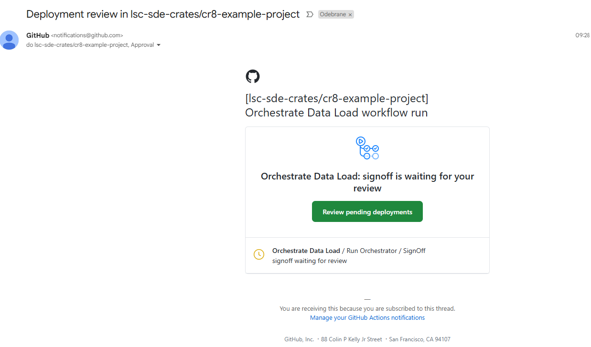
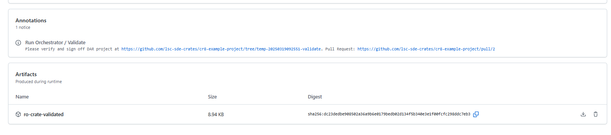
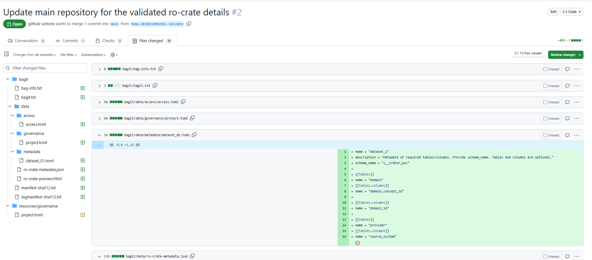
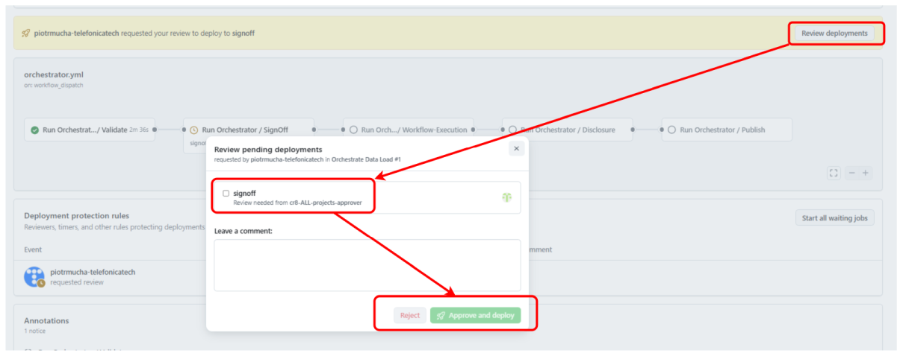
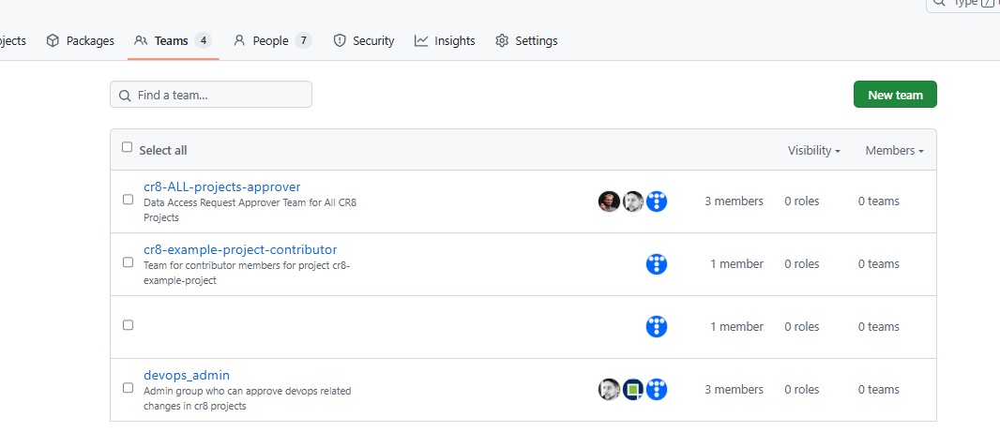

# Approve DAR

## How to approve Data Access Request

Orchestration layer requires manual approvals before the GitHub workflow can start the data retrieval and data publishing phases.
This solution uses GitHub Environments with protection rules.
Currently, there is a single GitHub Team **cr8-ALL-projects-Approver** which is assigned to all DAR projects. This team is responsible for reviewing and approving Data Access Requests to ensure compliance with governance and access policies. Members of that group are notified (e.g. by email) when the workflow reaches **Sign Off stage** or **Disclosure stage**.

Example email notification:

The Approver should validate the Data Access Request files, mainly access, metadata and governance files and assess if the user can have the access to the underlying datasets.
There is a Pull Request created which helps identifying the changes in the files, as well as artifact created which can be downloaded and explored locally.

Once the approver is satisfied with the request, they should click on **Review deployments**, mark the signoff, and then click **Approve and deploy**.

Alternatively, Approver can reject the stage, leaving a comment in the workflow or even providing comments directly in the Pull Request (suggesting the changes).

## How to add new members to Approver team

Navigate to GitHub Teams, click on **cr8-ALL-projects-approver**, then Add a member. If a member is not part of the Organisation, you need to invite him.

By default, team members have Read access to DAR project repositories.
