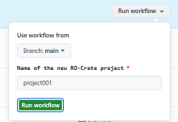

# Creating a new DAR project

There are two ways we can create a new Data Access Request (DAR) project:

1.) [Cr8tor CLI `Initiate` command](#cr8tor-cli-initiate-command)

2.) [GitHub Action Init RO-Crate project](#github-action-init-ro-crate-project)

## Cr8tor CLI `Initiate` command
Details of `cr8tor initiate` command can be found here: [Initiate command](./../commands.md#initiate-project).

Steps:

1. Instal uv and cr8tor cli following [Readme](https://github.com/lsc-sde-crates/cr8tor/blob/main/README.md)
2. Activate virtual environment
3. Change directory using `cd` command to the place you want to store your new project's folder
4. Run `cr8tor initiate` command providing template (`-t`) argument.

   Example - default, with cookiecutter prompts:

   ```

   uv run  cr8tor  initiate -t "https://github.com/lsc-sde-crates/cr8-cookiecutter"

   ```
   The command will download cookiecutter and start the prompt:
   

   Example - without cookiecutter prompts

   ```

   uv run  cr8tor  initiate -t "https://github.com/lsc-sde-crates/cr8-cookiecutter" -n "project4" -org "lsc-sde-crates" -e "DEV"

   ```
   We can provide the project name as a parameter `-n`, as well as GitHub organisation `-org` and target environment `-e`.

   If we add `--push` argument, the application will try to create the remote repository and GitHub Teams and assign the correct GitHub's roles and permissions.

???+ warning

    *--push* argument requires GitHub PAT token with the necessary organisation level permission. See **TODO** for token permission details. Store the token under GH_TOKEN Eviornment Variable (expected by *gh_rest_api_client* module)


   On successful run, we should see the new project's folder with sample access, governance and metadata files. If it is not already linked to the remote GitHub repository, link it. If remote does not exist, create/request it following [below steps](#github-action-init-ro-crate-project).
   Follow [update resources](update-resources-files.md) to progress with next steps.
   

## GitHub Action `Init RO-Crate project`
If we do not have a PAT token or we do not want to use Cr8tor CLI Initate command to create for us GitHub's repository, then we can use the GitHub Action which runs the Initiate command for us.
Workflow is located in the main cr8tor repository: [Init RO-Crate project](https://github.com/lsc-sde-crates/cr8tor/actions/workflows/init_project.yml)


Then, we need to provide the requested project name



If the project name is e.g. `project001`, the **GitHub repository** created will be named `cr8-project001`.


Now, clone the repository to your local machine and update the resources toml files. Follow [update resources](update-resources-files.md)

By default, you cannot push directly to the main branch, but you need to create a pull request to it. The changes to the files in .github folder are restricted by CODEOWNERS feature and require approval by devops_admin GitHub team.
