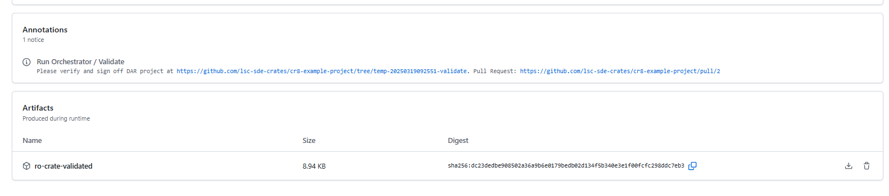
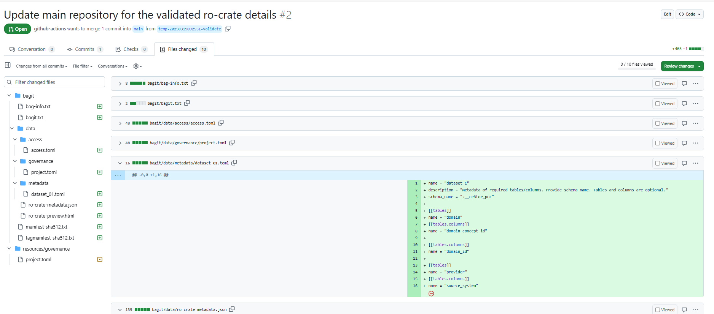

# Orchestrate DAR

## How to start data retrieval process

Once we have access, metadata and governance files prepared in the ./resources folder in our project's GitHub repository (main branch), we can start the **Orchestrator workflow**.

In your GitHub repository, navigate to Actions -> Orchestrate Data Load workflow. The workflow starts on demand, but the internal logic is specifically designed to work with the 'main' branch, ensuring proper execution and data consistency. Therefore, make sure to use the main branch and click Run workflow.


The workflow executes 5 key stages:

1) Validate

2) SignOff

3) Workflow-Execution

4) Disclosure

5) Publish

### Validate

Validate stage runs two cr8tor cli commands:

```text
 cr8tor create
 cr8tor validate
```

Create command checks basic configuration and creates bagit and ro-crate metadata objects.

Validate command initialises the connection to the source database (e.g. Databricks Unity Catalog), fetches the metadata of requested tables and columns and returns them back. Cr8tor makes here connections to the Approval Service endpoint project/validate (**TODO link to specific docs**).

The results of commands are committed to a temporary git branch (like *temp-20250305124305-validate*) and a Pull Request from the temp branch to the main branch is created.

### Sign Off


Sign Off stage uses GitHub repository environment with protection rules. It requires the approval from the assigned members. Currently, there is a single GitHub Team **cr8-ALL-projects-approver** which is assigned to all DAR projects. Members of that group are notified (e.g. by email) when the workflow reaches Sign Off stage.

Example email notification:


The approver should validate the Data Access Request files, focusing on access, metadata, and governance files. They should also assess whether the user can access the underlying datasets.
There is a Pull Request created which helps identifying the changes in the files, as well as artifact created which can be downloaded and explored locally.





Once approver is happy with the request, one should click on **Review deployments**, then mark signoff and click **Approver and deploy**.


Alternatively, approver can reject the Sign Off stage, leaving a comment in the workflow or even providing comments directly in the Pull Request (suggesting the changes).

Once Approved, the workflow runs

```text
 cr8tor sign-off
```

command which updates the ro-crate files with required logging and auditing logic (based on 5S-crate policy).
Next, the Pull Request (from temp to main branch) is merged and a temp branch is deleted.

### Workflow-Execution


Workflow-Execution stage runs

```text
 cr8tor stage-transfer
```

command which starts the data retrieval process. It makes a connection to the Approval Service project/package endpoint (**TODO link to specific docs**). Data is stored in the dedicated storage account in the **staging** container. **Data is not yet available for the researcher**, awaiting final approval in Disclosure process.

Similarly to Validate stage, a new temp branch (like *temp-20250305124305-stagetransfer*) is created as well as a Pull Request to the main branch.


### Disclosure


Likewise Sign Off stage, we request another review and approval from the GitHub Team **cr8-ALL-projects-approver**. Team is notified by email, and should verify the content of the files. Pull Request helps here identifying the changes between previous approval and now, as well as auditing trails logged in the ro-crate metadata files. One can also use artifact ro-crate-staged and analyse the files locally.

When the approver is happy with the request, one should click on **Review deployments**, then mark signoff and click **Approver and deploy**.

### Publish


Publish stage runs

```text
 cr8tor publish
```

command which starts the publishing process. It makes a connection to the Approval Service project/publish endpoint (**TODO link to specific docs**).

Similarly to previous stages, a new temp branch (like *temp-20250305124305-publish*) is created as well as a Pull Request to the main branch. Pull Request is automatically merged to the main branch.

If everything runs successfully, a final annotation should appear in the workflow Summary, and we can explore all artifacts created after each stage run.


We can also explore the files directly in the repository


