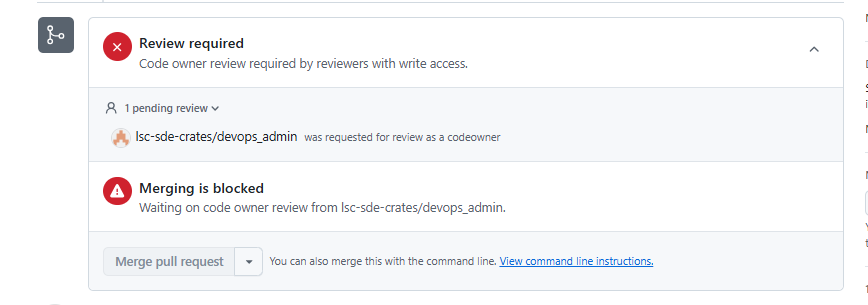

# Troubleshooting

## Local project folder not linked to remote GitHub repository

If we created a new project using cr8tor cli initiate command, but not used --push argument, we might end up with the new project folder but unlinked to its remote GitHub repository.
In this situation, first make sure that the remote GitHub repository exists. If it does not, request from Organisation's  administrator a new repository. Administrator needs the project name and environment you intend to use (PROD by default, DEV and TEST are dedicated for Developers). Administrator will run dedicated workflow as explain in [Create a new DAR project - GitHub Action Init RO Crate Project](create-new-dar-project.md#github-action-init-ro-crate-project).

Then, we need to initiate the git. You can do it, e.g. using your IDE UI or with below git commands.

```text
    cd <my-project-folder>
    git init
    git remote add origin <remote-repository-url>
    git fetch
    git checkout -b my-new-branch
    git add .
    git commit -m "my initial changes"
    git merge origin/main --allow-unrelated-histories
    git push --set-upstream origin my-new-branch
```

Resolve any merge conflicts between origin/main and your local branch, then push to remote branch and create a new Pull Request to main  branch.

<u>Alternative approach is to clone the remote repository first, and then replace relevant files.</u>

## Changing files in .github folder

The changes to the files in the .github folder are restricted by the CODEOWNERS feature, which allows repository owners to define individuals or teams responsible for approving changes to specific files. Approval by the devops_admin GitHub team is required.



## Databricks API error: User does not have SELECT on...

Microservices and Cr8tor can return error "*Databricks API error: User does not have SELECT on*" during Validation or WorkflowExecution(Stage-Transfer) jobs.

The error means that serviceprincipal specified in the [access/access configuration](./update-resources-files.md#accessaccess) does not have correct permission on the given datasource. [Follow this guide](./../developer-guide/source-setup.md#databricks-unity-catalog) for how to set up and assign correct permissions.
