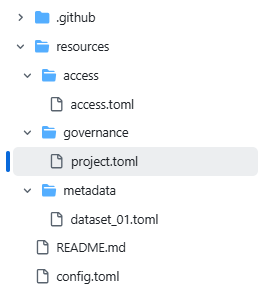

# Updating DAR resource files

Every Data Access Request (DAR) project consists of below key files:

1) config

2) governance/project

3) access/access

4) metadata/dataset

They are all toml files. The `cr8tor` initiate command uses a cookie-cutter template which provides you with the basic version of them. The content needs to be updated with relevant information before you can successfully run the orchestration workflow.

## config

The `config` file contains the following fields, which must be populated with relevant information:

| Field                 | Description                                         |
| :-------------------- | :-------------------------------------------------- |
| `Source-Organization` | *eg. `LSC SDE`*                                     |
| `Organization-Address`| *eg. `Lancashire Teaching Hospitals NHS Trust, PR2 9HT`* |
| `Contact-Name`        | *eg. `LSC SDE Program Team`*                        |
| `Contact-Email`       | *eg. `lsc.sde@test.com`*                            |

## governance/project

The `governance/project` contains the following fields, which must be populated with relevant information:

**[project]**

| Field                 | Description                                         |
| :-------------------- | :-------------------------------------------------- |
| `description`         | *eg. `example-project created using CR8TOR.`*       |
| `reference`           | auto-generated by cookie-cutter based on project_name. Pattern cr8-&lt;project_name&gt;|
| `name`                | auto-generated by cookie-cutter based on project_name|
| `project_name`        | follow organisation policy for project naming convention |
| `destination_type`    | Currently only two types are supported: [NW, LSC] |
| `destination_format`  | Currently only two formats are supported: [CSV, DUCKDB] |

**[repository]**

| Field            | Description                                                                                     |
| :--------------- | :---------------------------------------------------------------------------------------------- |
| `codeRepository` | Auto-generated by cookie-cutter. *e.g., `https://github.com/lsc-sde-crates/cr8-example-project`* |
| `description`    | Auto-generated by cookie-cutter.                                                               |
| `name`           | Auto-generated by cookie-cutter.                                                               |

**[requesting_agent]**

| Field            | Description            |
| :--------------- | :--------------------- |
| `name`           | e.g. *Prof. Jane Doe* |

**[requesting_agent.affiliation]**

| Field  | Description                     |
| :----  | :------------------------------ |
| `url`  | e.g. *https://someuni.com*      |
| `name` | e.g. *Jane Doe's University*   |

## access/access

The `access/access` contains the following fields, which must be populated with relevant information:

**[source]**

The required source fields depends on the type of the source. Currently, the Solution supports extracting data from the Databricks SQL warehouse endpoint.
The required fields for that type (DatabricksSQL) are validated by cr8tor and cr8tor-publisher app (using pydantic models).

**[source]**

| Field         | Description                                                                                     |
| :------------ | :---------------------------------------------------------------------------------------------- |
| `name`        | Name of the data source, e.g., *`Cr8tor POC Connection`*.                                       |
| `type`        | Must match `cr8tor-publisher` supported data types. Currently only: [*DatabricksSQL*].          |
| `host_url`    | Host URL of the Databricks workspace, e.g., *`https://adb-1868816176859647.7.azuredatabricks.net`*. |
| `http_path`   | HTTP path for the Databricks SQL Warehouse endpoint, e.g., `/sql/1.0/warehouses/0aec44b2e70e201d`. |
| `port`        | Optional. Default is 443 for Databricks SQL endpoints.                                          |
| `catalog`     | Databricks Unity Catalog name from which data will be extracted.                                |

**[credentials]**

Credentials fields are tied to the source we want to extract data from.
Currently, for Databricks SQL endpoint, we use Databricks Service Principal (SPN). [**See here how to create a new SPN and assign required roles and permissions.**](./../developer-guide/source-setup.md)

| Field            | Description                                                                                     |
| :--------------- | :---------------------------------------------------------------------------------------------- |
| `provider`       | Credential provider, e.g., *`AzureKeyVault`*.                                                   |
| `spn_clientid`   | Service principal client ID, e.g., *`databricksspnclientid`*.                                   |
| `spn_secret`     | Service principal secret, e.g., *`databricksspnsecret`*.                                        |

## metadata/dataset

We expect a single file per dataset (in terms of Databricks SQL source, it is per Unity Catalog schema).
The `metadata/dataset` file is contains the following fields, which must be populated with relevant information:

| Field         | Description                                                                                     |
| :------------ | :---------------------------------------------------------------------------------------------- |
| `name`        | Name of the dataset, e.g., *`dataset_1`*.                                                       |
| `description` | Description of our dataset.                                                                     |
| `schema_name` | Schema name, e.g., *`z__cr8tor_poc`*.                                                           |

???+ warning

    Now, we can define the tables and columns we want to retrieve, but this is **optional**.
    If we do not provide tables and/or columns, the solution will retrieve all available tables and/or columns.

**[[tables]]**

| Field         | Description                                                                                     |
| :------------ | :---------------------------------------------------------------------------------------------- |
| `name`        | Name of the table, e.g., *`domain`*.                                                            |

**[[tables.columns]]**

| Field         | Description                                                                                     |
| :------------ | :---------------------------------------------------------------------------------------------- |
| `name`        | Name of the column, e.g., *`domain_concept_id`*.                                                |
